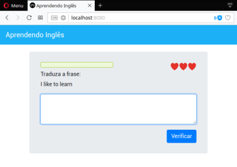
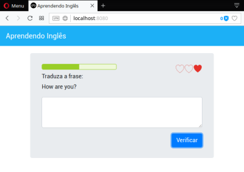
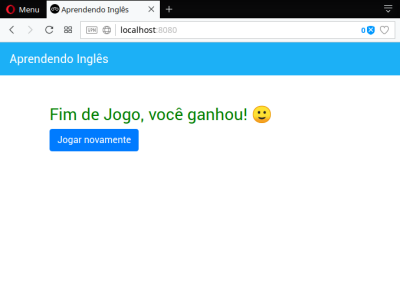
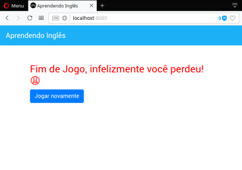

# WebApp Aprendendo inglês
Este repositório contêm um "Demo" WebApp desenvolvido com AngularJs.

Projeto desenvolvido no módulo 5 do [Curso de Desenvolvimento WEB com ES6, TypeScript e Angular 4](https://www.udemy.com/curso-de-desenvolvimento-web-com-es6-typescript-e-angular-4)

Os objetos deste projeto são:
- Introduzir ao Angular 4
- Entender a estrutura de um projeto Angular
- Conhecer alguns componentes do Angular
- Combinar outros recursos como Bootstrap e Html ao Angular 
- Compreender Property Binding, String Interpolation, Event Binding, ciclo de vida dos componentes...

## Requisitos

Para rodar essa aplicação localmente serão necessários:
- node
- npm
- angular-cli

Para realizar o deploy local, basta instalar via npm o pacote:
- http-server

Ou então via XAMPP, LAMP...

## Versão 1.0

Este app não deve ganhar novas atualizações, visto que seu objetivo foi concluído.

## Screenshots da aplicação

